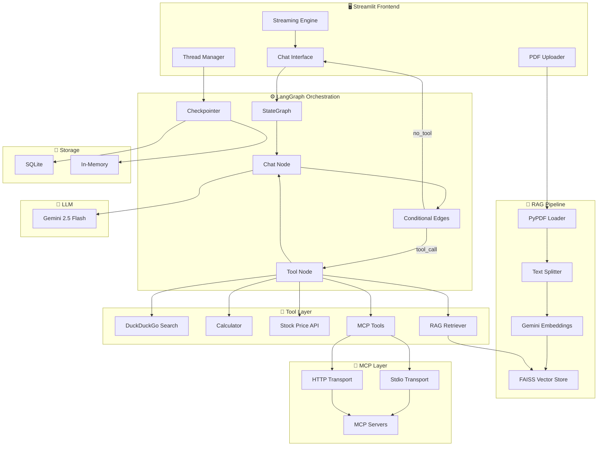
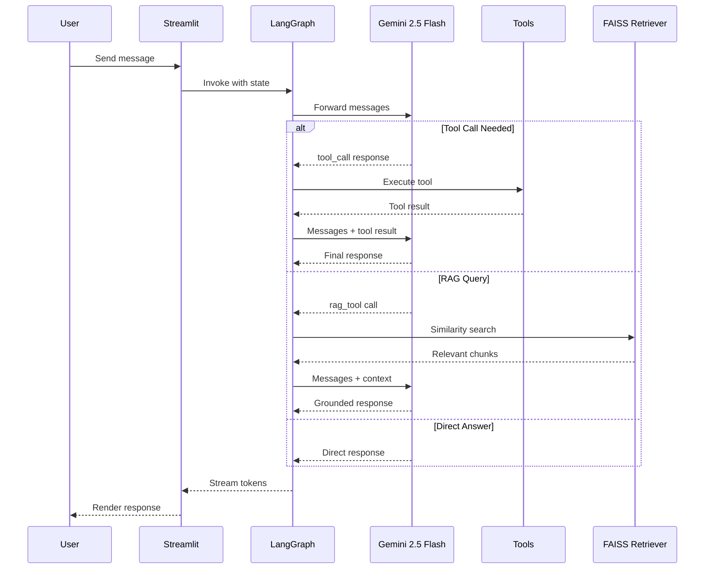
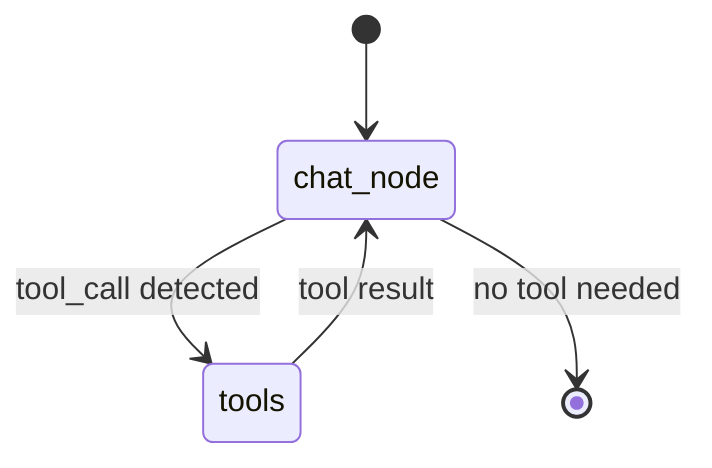

<div align="center">

# 🏛️ ATLAS

### **A**gentic **T**ool-calling **L**LM with **A**daptive **S**tate

**A production-grade AI chatbot platform built on LangGraph, featuring RAG, MCP integration, tool calling, and persistent memory — powered by Google Gemini.**

[](https://python.org)
[](https://langchain-ai.github.io/langgraph/)
[](https://streamlit.io)
[](https://ai.google.dev/)
[](LICENSE)

<br/>

[Features](#-features) · [Architecture](#-architecture) · [Quick Start](#-quick-start) · [Examples](#-example-usage) · [Deployment](#-deployment) · [Contributing](#-contributing)

</div>

---

## 🎯 Overview

### The Problem

Building AI chatbots that go beyond simple prompt-response patterns requires orchestrating multiple complex systems — **tool calling**, **document retrieval**, **protocol integration**, **persistent memory**, and **real-time streaming** — all while maintaining clean state management and a responsive user experience.

### The Solution

**ATLAS** is a modular, progressively-architected AI chatbot platform that demonstrates how to build production-grade agentic systems using **LangGraph** as the orchestration backbone. Each module incrementally adds capabilities — from a basic chatbot to a full-featured RAG + MCP + Tool-calling agent — making it both a **learning resource** and a **production-ready foundation**.

### Why ATLAS?

| Challenge | How ATLAS Solves It |
|-----------|-------------------|
| Complex agent state management | LangGraph's typed state graphs with conditional edges |
| Conversation persistence | SQLite checkpointers with thread-based isolation |
| Document-grounded answers | FAISS-backed RAG pipeline with per-thread retriever isolation |
| External tool integration | Native tool binding + Model Context Protocol (MCP) support |
| Real-time user experience | Token-level streaming with tool status indicators |
| Production deployment | Docker support with health checks and volume persistence |

---

## ✨ Features

<table>
<tr>
<td width="50%">

### 🤖 Agent Orchestration
LangGraph state graphs with typed state, conditional edges, and prebuilt tool routing patterns.

### 🔧 Tool Calling
Native LangChain tool integration — web search (DuckDuckGo), calculator, stock prices (Alpha Vantage) — with automatic tool selection by the LLM.

### 📄 RAG Pipeline
Upload PDFs → chunk with `RecursiveCharacterTextSplitter` → embed with Gemini embeddings → retrieve via FAISS → augment LLM context. Per-thread retriever isolation ensures multi-user safety.

</td>
<td width="50%">

### 🔌 MCP Integration
Model Context Protocol support via `langchain-mcp-adapters` with both **stdio** (local servers) and **streamable HTTP** (remote servers) transports.

### 💾 Persistent Memory
Conversation persistence via SQLite checkpointers with thread-based isolation. Create, switch, and resume conversations across sessions.

### 📊 Observability
Built-in LangSmith tracing support for monitoring agent decisions, tool calls, retrieval quality, and latency in production.

</td>
</tr>
<tr>
<td width="50%">

### ⚡ Real-Time Streaming
Token-level response streaming with live tool execution status indicators in the Streamlit UI.

</td>
<td width="50%">

### 🐳 Docker Deployment
Production-ready Dockerfile with health checks, multi-stage builds, and Docker Compose for one-command deployment.

</td>
</tr>
</table>

---

## 🏗️ Architecture

### System Architecture



### Request Flow



### Agent State Graph



---

## 🛠️ Tech Stack

| Layer | Technology |
|-------|-----------|
| **LLM** | Google Gemini 2.5 Flash |
| **Orchestration** | LangGraph 0.6+ |
| **Framework** | LangChain 0.3+ |
| **Embeddings** | Gemini `gemini-embedding-001` |
| **Vector Store** | FAISS (CPU) |
| **MCP** | `langchain-mcp-adapters` (stdio + HTTP) |
| **Memory** | SQLite / In-Memory Checkpointers |
| **Frontend** | Streamlit 1.47+ |
| **PDF Processing** | PyPDF + RecursiveCharacterTextSplitter |
| **Search** | DuckDuckGo Search |
| **Observability** | LangSmith |
| **Deployment** | Docker + Docker Compose |

---

## 🚀 Quick Start

### Prerequisites

- Python 3.11 or higher
- A [Google Gemini API key](https://aistudio.google.com/apikey) (free tier available)

### 1. Clone the Repository

```bash
git clone https://github.com/sankalpbhosale0369-cell/ATLAS.git
cd ATLAS
```

### 2. Set Up Virtual Environment

```bash
python -m venv .venv

# Linux / macOS
source .venv/bin/activate

# Windows
.venv\Scripts\activate
```

### 3. Install Dependencies

```bash
pip install -r requirements.txt
```

### 4. Configure Environment

```bash
cp .env.example .env
```

Edit `.env` and add your API key:

```env
GOOGLE_API_KEY=your_gemini_api_key_here
```

### 5. Launch

```bash
# Full-featured RAG chatbot (recommended)
streamlit run streamlit_rag_frontend.py

# Or choose a specific variant:
streamlit run streamlit_frontend.py              # Basic chatbot
streamlit run streamlit_frontend_streaming.py    # With streaming
streamlit run streamlit_frontend_database.py     # With persistence
streamlit run streamlit_frontend_tool.py         # With tool calling
streamlit run streamlit_frontend_mcp.py          # With MCP integration
```

Open your browser at **http://localhost:8501** and start chatting! 🎉

---

## 💡 Example Usage

### Basic Chat
```
You: What is the capital of France?
ATLAS: The capital of France is Paris...
```

### Tool Calling — Web Search
```
You: What are the latest developments in quantum computing?
🔧 Using DuckDuckGo Search...
ATLAS: Based on recent search results, here are the latest developments...
```

### Tool Calling — Stock Price
```
You: What's the current stock price of Tesla?
🔧 Using get_stock_price...
ATLAS: The current stock price of TSLA is...
```

### Tool Calling — Calculator
```
You: What is 1547 * 382?
🔧 Using calculator...
ATLAS: 1,547 × 382 = 590,954
```

### RAG — PDF Question Answering
```
1. Upload a PDF via the sidebar
2. Ask questions about the document

You: Summarize the key findings from this paper
🔧 Using rag_tool...
ATLAS: Based on the uploaded document, the key findings are...
```

### MCP — External Server Tools
```
You: Track my expense of $50 for groceries
🔧 Using MCP expense tool...
ATLAS: I've recorded your expense of $50 for groceries.
```

---

## 📁 Project Structure

```
ATLAS/
├── 🔧 Backend Modules (Progressive Architecture)
│   ├── langgraph_backend.py              # Level 1: Basic chat + in-memory checkpointing
│   ├── langgraph_database_backend.py     # Level 2: SQLite persistent memory
│   ├── langgraph_tool_backend.py         # Level 3: Tool calling (search, calc, stocks)
│   ├── langgraph_mcp_backend.py          # Level 4: MCP integration (stdio + HTTP)
│   └── langraph_rag_backend.py           # Level 5: Full RAG pipeline + all tools
│
├── 🖥️ Frontend Modules (Progressive UI)
│   ├── streamlit_frontend.py             # Minimal single-thread chat
│   ├── streamlit_frontend_streaming.py   # Token-level response streaming
│   ├── streamlit_frontend_database.py    # Multi-thread conversation management
│   ├── streamlit_frontend_threading.py   # Thread management + tool-aware streaming
│   ├── streamlit_frontend_tool.py        # Tool status indicators
│   ├── streamlit_frontend_mcp.py         # Async MCP with status UI
│   └── streamlit_rag_frontend.py         # PDF upload + RAG chat (full-featured)
│
├── 📋 Configuration
│   ├── .env.example                      # Environment variable template
│   ├── .gitignore                        # Git exclusions
│   └── requirements.txt                  # Python dependencies
│
├── 🐳 Deployment
│   ├── Dockerfile                        # Production container image
│   ├── docker-compose.yml                # One-command deployment
│   └── .dockerignore                     # Docker build exclusions
│
├── 📖 Documentation
│   ├── README.md                         # This file
│   ├── CONTRIBUTING.md                   # Contribution guidelines
│   ├── CODE_OF_CONDUCT.md               # Community standards
│   └── LICENSE                           # MIT License
│
└── 📦 Generated (gitignored)
    ├── chatbot.db                        # SQLite conversation store
    └── .venv/                            # Virtual environment
```

---

## 🗺️ Roadmap

### Short-Term (v1.x)

- [ ] Add unit and integration test suite
- [ ] Add CI/CD with GitHub Actions
- [ ] Support for multiple PDF uploads per thread
- [ ] Add conversation export (JSON / Markdown)
- [ ] Implement rate limiting and input validation
- [ ] Add Streamlit authentication

### Long-Term (v2.0+)

- [ ] Multi-agent collaboration with specialized agent roles
- [ ] FastAPI backend with WebSocket streaming
- [ ] PostgreSQL + pgvector for production vector storage
- [ ] Kubernetes deployment manifests
- [ ] Custom fine-tuned embedding models
- [ ] Agent evaluation framework with automated benchmarks
- [ ] Plugin system for community-built tools
- [ ] Voice input/output integration
- [ ] Multi-modal document support (images, tables, charts)

---

## 🐳 Deployment

### Local Deployment

```bash
# 1. Follow the Quick Start steps above
# 2. Run with Streamlit
streamlit run streamlit_rag_frontend.py
```

### Docker Deployment

```bash
# Build and run with Docker Compose (recommended)
docker compose up -d

# Or build and run manually
docker build -t atlas-chatbot .
docker run -p 8501:8501 --env-file .env atlas-chatbot
```

Access the application at **http://localhost:8501**

### Environment Variables

| Variable | Required | Description |
|----------|----------|-------------|
| `GOOGLE_API_KEY` | ✅ | Google Gemini API key |
| `ALPHA_VANTAGE_API_KEY` | ⬜ | Alpha Vantage key for stock prices |
| `MCP_MATH_SERVER_PATH` | ⬜ | Path to local MCP math server |
| `MCP_EXPENSE_SERVER_URL` | ⬜ | URL of MCP expense server |
| `PYTHON_EXECUTABLE` | ⬜ | Python binary for MCP stdio servers |
| `LANGCHAIN_TRACING_V2` | ⬜ | Enable LangSmith tracing (`true`/`false`) |
| `LANGCHAIN_API_KEY` | ⬜ | LangSmith API key |
| `LANGCHAIN_PROJECT` | ⬜ | LangSmith project name |

---

## 🤝 Contributing

Contributions are welcome! Please read our [Contributing Guidelines](CONTRIBUTING.md) and [Code of Conduct](CODE_OF_CONDUCT.md) before getting started.

```bash
# Fork → Clone → Branch → Code → PR
git checkout -b feat/amazing-feature
git commit -m "feat: add amazing feature"
git push origin feat/amazing-feature
```

---

## 📝 License

This project is licensed under the MIT License — see the [LICENSE](LICENSE) file for details.

---

## 🙏 Acknowledgements

- [LangChain](https://github.com/langchain-ai/langchain) — LLM framework
- [LangGraph](https://github.com/langchain-ai/langgraph) — Agent orchestration
- [Google Gemini](https://ai.google.dev/) — LLM and embeddings
- [Streamlit](https://streamlit.io/) — Frontend framework
- [FAISS](https://github.com/facebookresearch/faiss) — Vector similarity search
- [Model Context Protocol](https://modelcontextprotocol.io/) — Tool integration standard

---

## 📖 Citation

If you use ATLAS in your research or projects, please cite:

```bibtex
@software{atlas2025,
  author  = {Sankalp Bhosale},
  title   = {ATLAS: Agentic Tool-calling LLM with Adaptive State},
  year    = {2025},
  url     = {https://github.com/sankalpbhosale0369-cell/ATLAS},
  license = {MIT}
}
```

---

## 👤 Maintainer

**Sankalp Bhosale**

[](https://github.com/sankalpbhosale0369-cell)

---

<div align="center">

**If you found ATLAS useful, please consider giving it a ⭐**

Built with ❤️ using LangGraph + Gemini

</div>
